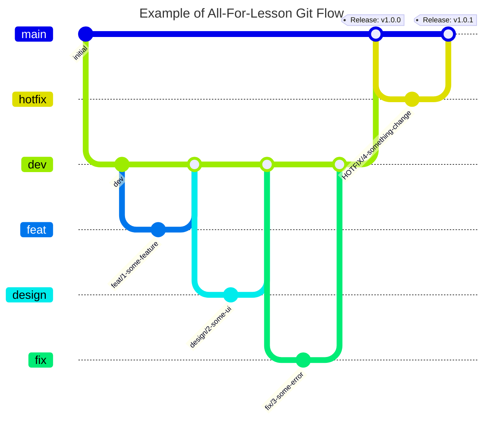

# 🎶 올포레슨 (All For Lesson) - 클래식 음악 레슨 매칭 플랫폼

<br />

<div align="center">
  
  <br /><br />
  
  
  

</div>

<br /><br />

## 기획의도 (Intention)
> ### 나와 멀다고 생각했던 클래식 음악, 이제 내 손으로 직접 배워보자!

- "가사가 없어서 지루해요", "제목이 어려워요", "어떻게 즐겨야 하는지 모르겠어요"
- 위와 같은 다양한 이유들로 클래식 음악은 아는 사람만 아는 고급 예술 문화가 되었습니다.
- 하지만 클래식은 단순 감상을 넘어 직접 연주해보고, 연관된 배경 지식을 채우는 것만으로도 쉽게 즐길 수 있습니다.
- 올포레슨은 클래식을 처음 알아가고 싶은 비전공자와, 전공을 시작하려는 예비 전공자를 위해 다양한 클래식 음악 레슨과 강의를 매칭할 수 있도록 도와줍니다.

<br />

## 프로젝트 소개 (Description)
> **개발 기간** : 2024. 08. 15 ~ 2024. 09. 08 (약 3주)<br />
> **개발 인원** : 1인 (기획/디자인/개발)<br />
> **최소 버전** : iOS 15.0+<br />

<br />

<div align="center">
  
  
  
  
  
</div>

<br /><br />

## 사용 기술 및 개발 환경  (Tech Stack & Environment)
- **iOS** : Swift 5.1, Xcode 15.4, UIKit, WebKit
- **UI** : Codebase UI, Kingfisher, SnapKit, Tabman & Pageboy, TextFieldEffects
- **Architecture** : MVVM (Input-Output)
- **Reactive** : RxSwift
- **Network** : Alamofire
- **Payments** : iamport-iOS
- **Utility** : Then

<br />

## 아키텍쳐 (Architecture)


- RxSwift를 통한 반응형 프로그래밍, MVVM Pattern 적용으로 UI와 Business Logic 분리
- Input-Output Pattern을 통해 양방향 데이터 바인딩으로 프로젝트 데이터 흐름 일원화
- Router Pattern을 통한 반복되는 네트워크 작업 추상화, RxSwift Single Traits와 Result Type을 통한 에러 핸들링

<br />

## 개발 방식 및 브랜치 전략 (Development & Branch Strategy)
### Issue, Pull Request(PR) 템플릿 활용한 프로젝트 관리
- 개발 시작 전 새로운 Issue 생성 후, Issue와 브랜치를 연결하고 이슈 번호를 브랜치명에 활용하여 일관된 작업 내용 기록
- Issue와 PR 생성 시 레이블을 표기하여 작업 종류와 진행사항을 한 눈에 알 수 있도록 처리
- PR 생성 시 템플릿에 맞게 작업 내용과 스크린샷을 상세히 기록하여 추후에도 프로젝트 진행 현황을 알 수 있도록 문서화

### 간소화된 Git Flow 도입
- **`main`**
  - 실제 서비스 배포용 브랜치
  - 큰 기능 단위 개발 작업이 완료된 후 병합 (Version Realese)
- **`dev`**
  - 개발 및 QA 작업용 브랜치 (Main 브랜치에서 분기)
  - 각 기능 단위 브랜치 작업이 완료된 후 병합
- **`feat`** , **`design`**, **`fix`**, **`refactor`**...
  - 작은 기능 단위 브랜치 (dev 브랜치에서 분기)
  - Issue, PR, Commit 컨벤션과 동일한 Prefix 사용하여 일관된 작업 구분
- 각 브랜치별 작업 내용 확인을 위해 브랜치명 컨벤션 도입
  - prefix/이슈번호-작업설명
  - `design/1-home-ui`



<details>
<summary><b>Prefix Convention 전체보기</b></summary>
<div>

| Prefix  | Description | Prefix  | Description | 
|------------|-----------|------------|-----------|
| Feat | 새로운 기능에 대한 커밋 | Style | UI 스타일에 관한 커밋 |
| Fix | 버그 수정에 대한 커밋 | Refactor | 코드 리팩토링에 대한 커밋 |
| Build | 빌드 관련 파일 수정에 대한 커밋 | Test | 테스트 코드 수정에 대한 커밋 |
| Chore | 그 외 자잘한 수정에 대한 커밋 | Init | 프로젝트 시작에 대한 커밋 |
| Ci | CI 관련 설정 수정에 대한 커밋 | Release | 릴리즈에 대한 커밋 |
| Docs | 문서 수정에 대한 커밋 | WIP | 미완성 작업에 대한 임시 커밋 |           

</div>
</details>

<br />

## 주요 기능 (Features)              
### 공통
- 전체 및 카테고리별 레슨 조회가 가능한 **메인 화면**
- 상세 정보 확인하고, 레슨 결제와 북마크 기능, 레슨 후기를 작성할 수 있는 **상세 화면**
- 해시태그를 통해 레슨 및 커뮤니티 게시물을 찾아볼 수 있는 **검색 화면**
- 선생님/수강생 타입으로 구분된 **회원가입** 기능

### 선생님
- 레슨 개설 기능
- 내가 개설한 레슨 목록 확인 및 레슨 수정 기능
- 레슨 수강 후기 확인 기능

### 수강생
- 결제한 레슨 목록 확인 기능
- 북마크한 레슨 목록 확인 기능

### 네트워크 통신과 에러 핸들링
- Request를 보내고, Decodable Model을 리턴받는 네트워크 통신 로직의 반복을 줄이기 위해 Alamofire와 Router Pattern을 함께 적용하여 네트워크 통신 로직 추상화
- Single Traits와 Result Type을 결합하여 네트워크 통신 실패 시에도 onError를 방출하지 않고 Stream이 유지되도록 처리
- Error Protocol을 채택한 NetworkErrorCase를 정의하여 네트워크 오류를 일관적으로 처리, 연산 프로퍼티를 활용한 커스텀 에러 메세지 출력


<br />

## 디렉토리 구조 (Directory Structure)
- Application : 시스템 기본 파일
- Model : 데이터 모델 관련 파일
- Network : 네트워크 통신 관련 Router 파일
- Case : 앱에서 사용하는 다양한 Enum을 정의한 파일
- Resource : 폰트, SF Symbols 관련 디자인 리소스
- Constants : 앱에서 사용하는 상수값들을 정의한 파일
- Component : 재사용 가능한 커스텀 셀과 커스텀 뷰 모음
- Presentation : 사용자에게 보여지는 화면과 관련된 파일

<details>
<summary><b>디렉토리 구조 전체보기</b></summary>
<div markdown="1">

```
📦 all-for-lesson
.github
│  ├─ ISSUE_TEMPLATE
│  │  └─ issue-template.md
│  └─ PULL_REQUEST_TEMPLATE.md
├─ .gitignore
├─ README.md
├─ all-for-lesson.xcodeproj
│  └─ project.pbxproj
└─ all-for-lesson
   ├─ Application
   │  ├─ AppDelegate.swift
   │  ├─ Base.lproj
   │  │  └─ LaunchScreen.storyboard
   │  ├─ Info.plist
   │  └─ SceneDelegate.swift
   ├─ Common
   │  ├─ Case
   │  │  ├─ BarButtonCase.swift
   │  │  ├─ HomeMenuCase.swift
   │  │  ├─ JoinCase.swift
   │  │  ├─ LoginViewCase.swift
   │  │  └─ NetworkErrorCase.swift
   │  ├─ Constant.swift
   │  └─ Resource
   │     ├─ Font
   │     │  ├─ Pretendard-Black.otf
   │     │  ├─ Pretendard-Bold.otf
   │     │  ├─ Pretendard-ExtraBold.otf
   │     │  ├─ Pretendard-ExtraLight.otf
   │     │  ├─ Pretendard-Light.otf
   │     │  ├─ Pretendard-Medium.otf
   │     │  ├─ Pretendard-Regular.otf
   │     │  ├─ Pretendard-SemiBold.otf
   │     │  └─ Pretendard-Thin.otf
   │     └─ Resource.swift
   ├─ Component
   │  ├─ Base
   │  │  ├─ BaseCollectionViewCell.swift
   │  │  ├─ BaseView.swift
   │  │  └─ BaseViewController.swift
   │  └─ CustomView
   │     ├─ Cell
   │     │  ├─ HashTagCollectionViewCell.swift
   │     │  ├─ HomeLessonCollectionViewCell.swift
   │     │  ├─ HomeMenuCollectionViewCell.swift
   │     │  ├─ LessonCollectionViewCell.swift
   │     │  └─ LessonCommentCollectionViewCell.swift
   │     ├─ CommonButton.swift
   │     ├─ CommonLabel.swift
   │     ├─ Join
   │     │  ├─ JoinLabel.swift
   │     │  └─ JoinTextField.swift
   │     ├─ MyPageMenuButton.swift
   │     ├─ OnboardingTypeButton.swift
   │     └─ UserTypeButton.swift
   ├─ Extenstion
   │  ├─ UIButton+.swift
   │  ├─ UIColor+.swift
   │  ├─ UIImage+.swift
   │  ├─ UIView+.swift
   │  └─ UIViewController+.swift
   ├─ Info.plist
   ├─ Manager
   │  ├─ NavigationManager.swift
   │  ├─ NetworkManager.swift
   │  ├─ ToastManager.swift
   │  ├─ UserDefaultsManager.swift
   │  └─ ValidationManager.swift
   ├─ Model
   │  ├─ DummyData
   │  │  └─ PostDummy.swift
   │  ├─ Request
   │  │  ├─ Pay
   │  │  │  └─ PayValidationBody.swift
   │  │  ├─ Post
   │  │  │  ├─ HashTagQuery.swift
   │  │  │  ├─ PostBody.swift
   │  │  │  ├─ PostCommentBody.swift
   │  │  │  ├─ PostFilesBody.swift
   │  │  │  ├─ PostQuery.swift
   │  │  │  └─ ReservationBookmarkBody.swift
   │  │  └─ User
   │  │     ├─ EmailBody.swift
   │  │     ├─ JoinBody.swift
   │  │     └─ LoginBody.swift
   │  └─ Response
   │     ├─ Pay
   │     │  ├─ MyPaymentsResponse.swift
   │     │  └─ PayValidationResponse.swift
   │     ├─ Post
   │     │  ├─ CommentResponse.swift
   │     │  ├─ PostFilesResponse.swift
   │     │  ├─ PostResponse.swift
   │     │  └─ ReservationResponse.swift
   │     └─ User
   │        ├─ EmailResponse.swift
   │        ├─ JoinResponse.swift
   │        ├─ LoginResponse.swift
   │        ├─ MyProfileResponse.swift
   │        ├─ RefreshTokenResponse.swift
   │        ├─ UserProfileResponse.swift
   │        └─ WithDrawResponse.swift
   ├─ Network
   │  └─ Router
   │     ├─ APIRouter.swift
   │     ├─ PayRouter.swift
   │     ├─ PostRouter.swift
   │     └─ UserRouter.swift
   ├─ Presentation
   │  ├─ Community
   │  │  └─ CommunityViewController.swift
   │  ├─ HashTag
   │  │  ├─ HashTagResult
   │  │  │  ├─ HashTagResultCommunityViewController.swift
   │  │  │  ├─ HashTagResultLessonViewController.swift
   │  │  │  ├─ HashTagResultViewController.swift
   │  │  │  └─ HashTagResultViewModel.swift
   │  │  ├─ HashTagView.swift
   │  │  ├─ HashTagViewController.swift
   │  │  └─ HashTagViewModel.swift
   │  ├─ Home
   │  │  ├─ HomeView.swift
   │  │  ├─ HomeViewController.swift
   │  │  └─ HomeViewModel.swift
   │  ├─ Join
   │  │  ├─ Student
   │  │  │  ├─ StudentJoinView.swift
   │  │  │  ├─ StudentJoinViewController.swift
   │  │  │  └─ StudentJoinViewModel.swift
   │  │  └─ Teacher
   │  │     ├─ TeacherJoinView.swift
   │  │     ├─ TeacherJoinViewController.swift
   │  │     └─ TeacherJoinViewModel.swift
   │  ├─ Lesson
   │  │  ├─ LessonDetail
   │  │  │  ├─ Control
   │  │  │  │  ├─ LessonCommentFieldView.swift
   │  │  │  │  ├─ LessonCommentView.swift
   │  │  │  │  └─ LessonDetailInfoView.swift
   │  │  │  ├─ LessonDetailView.swift
   │  │  │  ├─ LessonDetailViewController.swift
   │  │  │  └─ LessonDetailViewModel.swift
   │  │  ├─ LessonEdit
   │  │  │  ├─ LessonEditViewController.swift
   │  │  │  └─ LessonEditViewModel.swift
   │  │  ├─ LessonOpen
   │  │  │  ├─ LessonOpenView.swift
   │  │  │  ├─ LessonOpenViewController.swift
   │  │  │  └─ LessonOpenViewModel.swift
   │  │  ├─ LessonView.swift
   │  │  ├─ LessonViewController.swift
   │  │  └─ LessonViewModel.swift
   │  ├─ Login
   │  │  ├─ LoginView.swift
   │  │  ├─ LoginViewController.swift
   │  │  └─ LoginViewModel.swift
   │  ├─ MyPage
   │  │  ├─ MyBookmark
   │  │  │  ├─ MyBookmarkViewController.swift
   │  │  │  └─ MyBookmarkViewModel.swift
   │  │  ├─ MyComment
   │  │  │  ├─ MyCommentView.swift
   │  │  │  ├─ MyCommentViewController.swift
   │  │  │  └─ MyCommentViewModel.swift
   │  │  ├─ MyLesson
   │  │  │  ├─ MyLessonView.swift
   │  │  │  ├─ MyLessonViewController.swift
   │  │  │  └─ MyLessonViewModel.swift
   │  │  ├─ MyPageView.swift
   │  │  ├─ MyPageViewController.swift
   │  │  ├─ MyPageViewModel.swift
   │  │  └─ MyReservation
   │  │     ├─ MyReservationBookmarkView.swift
   │  │     ├─ MyReservationViewController.swift
   │  │     └─ MyReservationViewModel.swift
   │  ├─ Onboarding
   │  │  ├─ OnboardingView.swift
   │  │  ├─ OnboardingViewController.swift
   │  │  └─ OnboardingViewModel.swift
   │  ├─ Payments
   │  │  ├─ PaymentsViewController.swift
   │  │  └─ PaymentsViewModel.swift
   │  ├─ TabBar
   │  │  └─ CustomTabBarController.swift
   │  └─ UserDetail
   │     ├─ UserProfileView.swift
   │     ├─ UserProfileViewController.swift
   │     └─ UserProfileViewModel.swift
   └─ Protocol
      ├─ InputOutput.swift
      ├─ Reusable.swift
      └─ TargetType.swift
```
©generated by [Project Tree Generator](https://woochanleee.github.io/project-tree-generator)

</div>
</details>

<br />

## 트러블 슈팅  (Trouble Shooting)

### 1. 네트워크 통신 중 Token 갱신이 필요한 상황에 대한 핸들링
- **원인** : 네트워크 통신 중 AccessToken이 만료될 경우, RefreshToken을 사용해 AccessToken을 갱신하는데, 이 과정에서 이전에 진행하던 네트워크 통신이 종료되어 사용자가 같은 액션을 2번 이상 진행해야 하는 문제
- **고민** : 사용자가 알 수 없게 AccessToken을 갱신 과정을 숨기고, 기존 네트워크 통신까지 다시 진행하여 사용자 경험과 비즈니스 로직 두 가지를 모두 대한 고려한 기능 구현이 필요
- **해결** : Router Pattern을 사용해 추상화 되어있는 apiCall 함수 내에서 Status Code가 419일 때 AccessToken을 갱신하고, 재귀를 통해 현재 진행 중인 네트워크를 재호출하여 해결
	- AccessToken을 갱신하는 과정에서 RefreshToken도 함께 갱신해주어야 하는 경우에는 로그인 화면으로 전환하여 사용자 재로그인 유도
- **리팩토링** : Alamofier RequestInterceptor의 adapt, retry 함수를 사용하여 AccessToken 갱신이 필요한 경우 retry 함수 내에서 갱신을 진행하고, 네트워크 재호출 요청 처리
	- retry의 경우 API에 문제가 있을 때 끊임없이 Error가 발생하여 무한 루프에 빠질 수 있으므로 retryLimit을 정하여 토큰 갱신 시도를 제한
- **성과** : Token 갱신 처리에 대한 다양한 접근과 사용자 경험을 함께 고려한 시도를 해보게 되고, Alamofire RequestInterceptor 개념에 대해 새롭게 알게 됨

<br />

### 2. 네트워크 통신 실패 시 onError 이벤트 방출로 인해 Stream이 끊기는 문제
- **원인** : RxSwift에서 네트워크 통신 결과가 실패했을 때 onError 이벤트를 방출하여 Stream이 dispose 처리되기 때문에, 이후 같은 네트워크 통신이 필요한 User Interaction이 생겼을 경우 이벤트를 받을 수 없는 문제 발생
- **해결** : Single Traits와 Result Type을 사용하여 네트워크 통신이 실패하더라도 성공값으로 간주해 Success Case로 래핑하여 방출하고, bind 구문 안에서 switch문을 통해 래핑을 해제하고 성공/실패를 모두 처리할 수 있도록 구현 
- **성과** : Stream을 유지하면서 에러 핸들링을 할 수 있는 방법에 대해 고민하고 적용해볼 수 있게 됨. 


```swift
switch response.result {
case .success(let value):
	observer(.success(.success(value)))
case .failure(_):
	guard let networkError = NetworkErrorCase(rawValue: statusCode) else {
		return observer(.success(.failure(NetworkErrorCase.UnknownError)))
	}
	observer(.success(.failure(networkError)))
}
```

<br /><br />

### 3. 홈 화면에서 여러 Section마다 다른 Cell을 바인딩 해야 하는 문제
- **원인** : 홈 화면에는 메뉴 버튼으로 구성된 CollectionView와 인기 레슨/흥미 레슨으로 구성된 2개의 CollectionView까지 총 3개이 Section으로 이루어져 있었고, 메뉴와 레슨에서 각각 다른 Cell을 사용해야 하는 상황 
- **고민** : RxDataSoure 라이브러리를 활용해 해결할 수 있지만 외부 라이브러리 의존성이 높아지고, 기술 확장보다 우선순위가 높은 프로젝트 진행도와 완성도가 떨어지는 것에 대한 우려 발생
- **해결** : 기존 사용하던 기술에서 빠르게 활용 가능한 방향으로, ScrollView 위에 3개의 CollectionView를 구성하여 각 CollectionView에 맞는 Cell을 바인딩하여 해결
- **성과** : 프로젝트 진행 시 우선순위에 대해 고민하고, 우선순위에 맞는 작업 분배와 각 작업을 진행하는 방법에 대해 생각해보고 적용해볼 수 있게 됨

```swift
private func bind() {
    let viewDidLoadTrigger = self.rx.methodInvoked(#selector(self.viewWillAppear(_:)))
    
    let input = HomeViewModel.Input(viewDidLoadTrigger: viewDidLoadTrigger,
                                    menuButtonTap: homeView.menuCollectionView.rx.itemSelected,
                                    popularLessonTap: homeView.popularCollectionView.rx.modelSelected(Post.self),
                                    interestingLessonTap: homeView.interestingCollectionView.rx.modelSelected(Post.self))
    let output = viewModel.transform(input: input)
    
    // 각 CollectionView에 바인딩할 Cell 구성
    let menu = (id: HomeMenuCollectionViewCell.id,
                cellType: HomeMenuCollectionViewCell.self)
    let popular = (id: HomeLessonCollectionViewCell.id,
                   cellType: HomeLessonCollectionViewCell.self)
    let interesting = (id: HomeLessonCollectionViewCell.id,
                       cellType: HomeLessonCollectionViewCell.self)

    output.menuItems
        .bind(to: homeView.menuCollectionView.rx.items(cellIdentifier: menu.id, cellType: menu.cellType)) { item, element, cell in
            // ...
        }
        .disposed(by: disposeBag)
    
    output.popularLessonList
        .bind(to: homeView.popularCollectionView.rx.items(cellIdentifier: popular.id, cellType: popular.cellType)) { item, element, cell in
            // ...
        }
        .disposed(by: disposeBag)
    
    output.interestingLessonList
        .bind(to: homeView.interestingCollectionView.rx.items(cellIdentifier: interesting.id, cellType: interesting.cellType)) { item, element, cell in
            // ...
        }
        .disposed(by: disposeBag)
}
```

<br />

### 4. iamport-ios, Then 패키지 충돌 오류
- **원인** : iamport-ios SDK Dependency에서 이미 가지고 있는 Then 라이브러리와 직접 설치한 Then 라이브러리의 버전이 달라 충돌 발생
    - iamport-ios에서 의존하는 Then 라이브러리는 버전 2.7.0
    - 직접 설치한 Then 라이브러리는 버전 3.0.0 이상이기 때문에 서로 충돌
- **해결** : Then 라이브러리는 major 버전 2에서도 문제없이 동작하기 때문에, 직접 설치한 라이브러리를 삭제하고 iamport-ios에서 의존하고 있는 Then 라이브러리를 그대로 사용하여 해결
- **성과** : SDK 개발 시 특정 라이브러리에 의존하게 되면 발생할 수 있는 문제와, 모듈 간의 의존성에 대해 고민하고 학습할 수 있게 됨 

```swift=
// iamport-iOS dependincies
dependencies: [
    .package(url: "https://github.com/ReactiveX/RxSwift.git", .upToNextMajor(from: "6.0.0")),
    .package(name: "RxBusForPort", url: "https://github.com/iamport/RxBus-Swift", .upToNextMinor(from: "1.3.0")),
    .package(url: "https://github.com/Alamofire/Alamofire.git", .upToNextMajor(from: "5.4.0")),
    .package(url: "https://github.com/devxoul/Then.git", .upToNextMajor(from: "2.7.0")),
    .package(url: "https://github.com/nicklockwood/SwiftFormat", from: "0.50.4")
],
```

<br />

## 회고 (Restropective)
### Keep (좋았던 점)

### Problem (아쉬웠던 점)

### Try (앞으로 시도해볼 점)


<br />